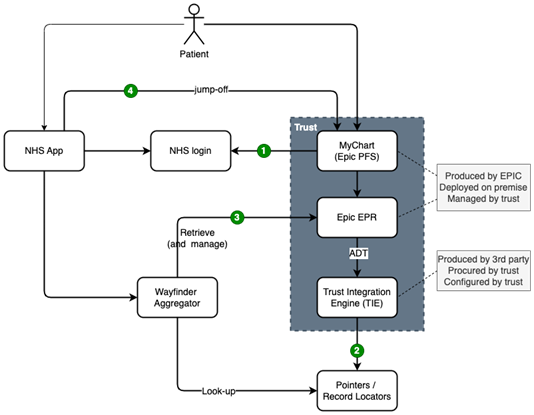
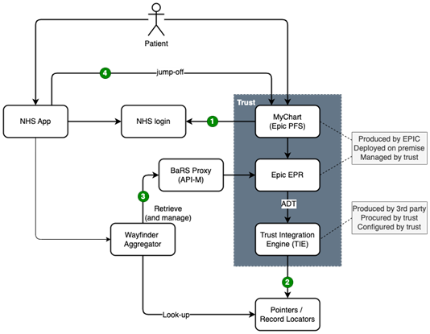

[Home](../readme.md)

# Logical Architecture

The diagrams below describe the logical integration architecture, 4 separate integration touchpoints:
1.	__Authentication__ - integration of MyChart and NHS login to enable central authentication for those users (patients) who have an active NHS login account
2.	__Signposting__ - upload of pointers to medical records (such as appointments, documents, etc.) to an NHSE-managed repository
3.	__Record retrieval (and management)__ - retrieval (and management, in the future) of appointments (and other medical records) from Epic EPR
4.	__Transfer__ - A controlled and seamless transfer (a 'jump-off') of user/patient activity/journey from NHS App to MyChart
As can be seen in the diagram, two options are considered.

Option A in __Figure 1__ assumes direct retrieval (and the management) of appointments by Wayfinder Aggregator from the Epic EPR.

Figure 1. Logical Integration Architecture (option A)

Option B in Figure 2 assumes that such retrieval (and the management) of appointments is carried out via a BaRS Proxy. This will be explained in more detail in the sections (below) on Record Retrieval.
In the following sections, the 4 integration touchpoints are described further, with the greatest focus on (2) – Signposting, and (3) – Record retrieval.

Figure 2. Logical Integration Architecture (option B)
