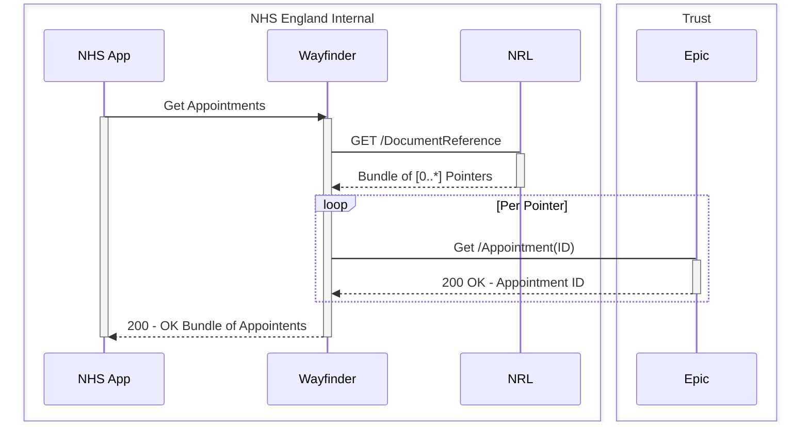
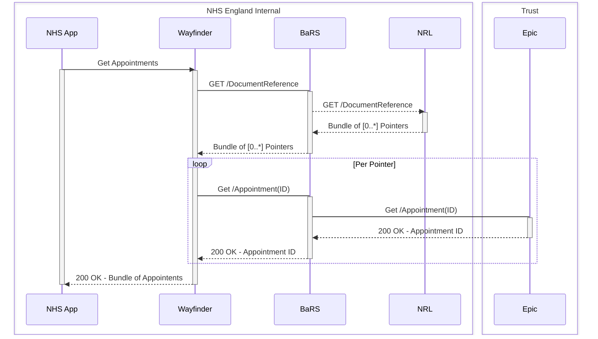

[Home](../readme.md)

[Next - Appendix 1: Signposting (technical detail)](appendix1.md)

# Record Retrieval

The strategic Epic/EPR solution MUST publish API endpoints which are FHIR UK Core R4 compliant. For instance, this means that a FHIR UK Core R4 compliant Appointment resource is returned in the response payload when Wayfinder Aggregator attempts to retrieve those records on behalf of a patient. The FHIR UK Core standard allows for FHIR extensions, and there are Wayfinder specific extensions as explained below.

As shown in [Figure 1](logical_arch.md#figure1) and [Figure 2](logical_arch.md#figure2), the integration can be done in one of two ways.

## Option A (tactical)

In this scenario, Wayfinder Aggregator retrieves the records (appointment data) by calling the Epic API directly. This is only a tactical option which may help achieve the First of Type integration in a quicker fashion.

## Lookup and Direct Retrieval

## Option B (strategic)

This is the strategic (target) option. In this scenario, the retrieval (and the management) of appointments is carried out via a BaRS Proxy. The FHIR API endpoint published by Epic/EPR MUST include the FHIR Capability Statement to allow future discovery about which specific interactions (such as Create a Booking, Retrieve/Read, Cancel, or Reschedule) are supported by the endpoint.

Note that the First of Type for this option will only include the retrieval of appointment data.

The low level technical detail is provided below in [Appendix 2](appendix2.md): Record retrieval (technical detail).

## Lookup and Retrieval via BaRS

