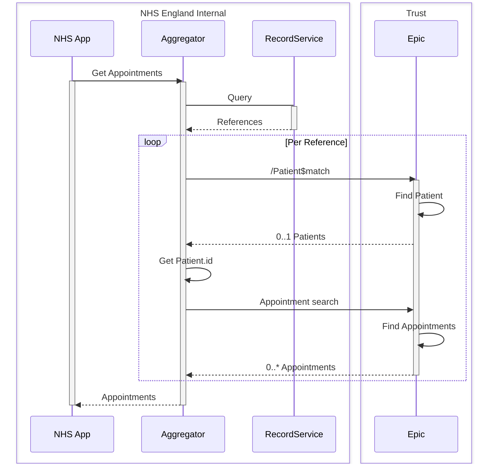

# Tactical approach

The tactical approach is to perpetuate the Wayfinder __Record Service__ approach.

This contains a record to represent each time a patient is registered in a Trust.

In the below, some assumptions are:

* 

## Lookup and Retrieval via BaRS

